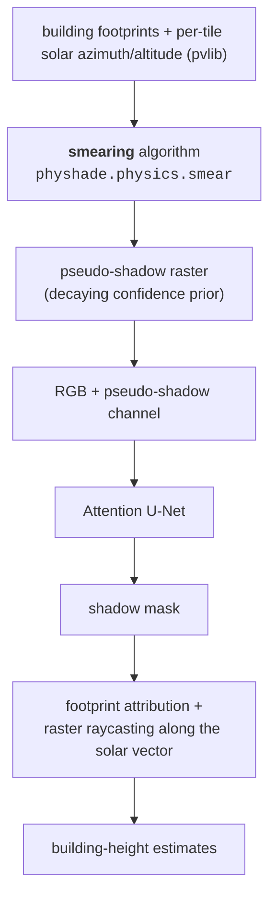
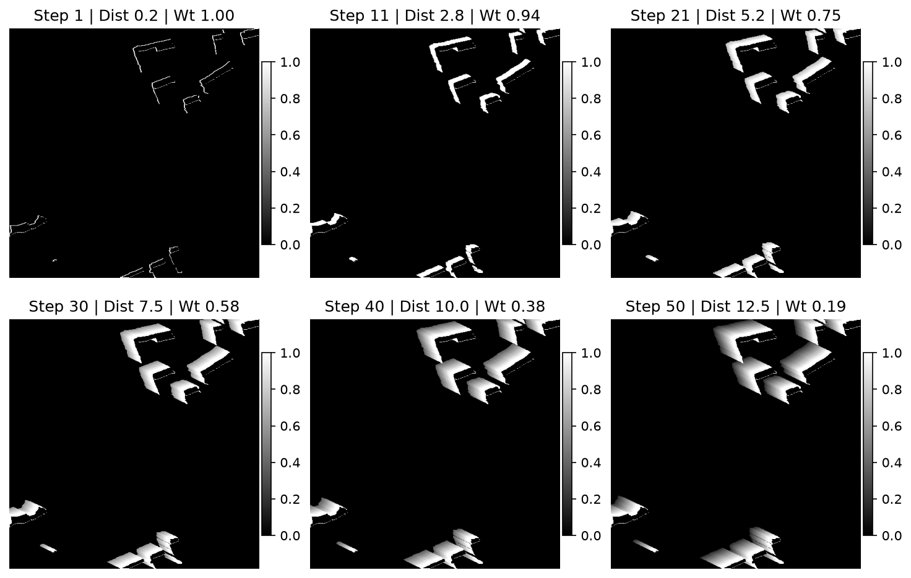
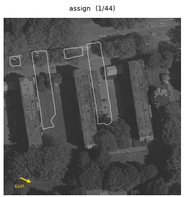
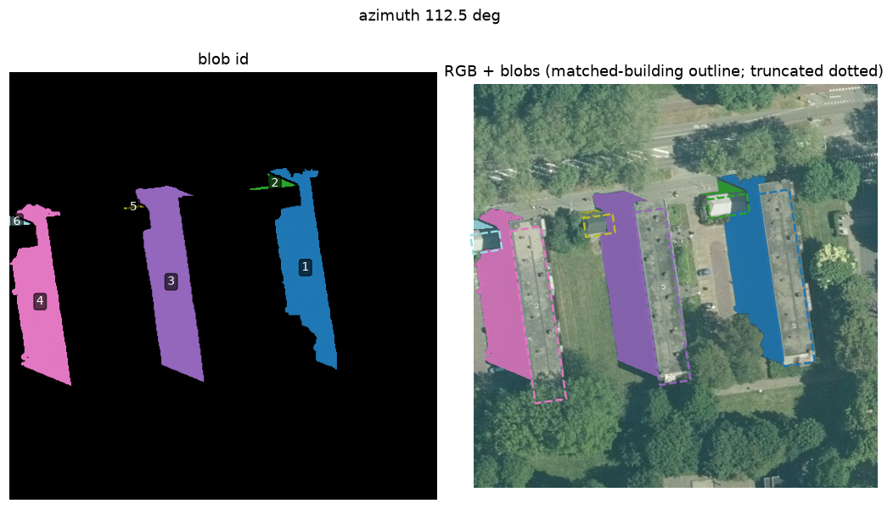

# PHYSHADE-Net

[](https://github.com/CorLaHu/PHYSHADE-Net/actions/workflows/ci.yml)
[](LICENSE)

**PHY**sics-guided **SHAD**ow segmentation and building-height **E**stimation with a physics-prior-injected U-Net — inspired by Physics-Informed Neural Networks (PINNs), but implementing the prior at the *input level* rather than in the architecture or loss.

> **PHYSHADE-Net** injects a physically computed pseudo-shadow prior — derived from building footprints and per-image solar geometry (pvlib) — as a 4th input channel into an attention U-Net, lifting shadow-segmentation Dice from **0.53 → 0.85** and enabling building height recovery to ~1.9 m RMSE without LiDAR at inference time.

## Why

Large-scale LiDAR scanning is costly; if shadows can be segmented accurately from ordinary aerial imagery, building heights become recoverable almost for free via `h = shadow_length × tan(solar_altitude)`. General-purpose shadow CNNs degrade sharply on cross-domain imagery (a state-of-the-art model dropped Dice ≈ 0.88 → 0.57 on Dutch data), so this work injects *geometric knowledge* into the network instead of relying purely on learned features.

## Method





*The smear prior: building footprints are iteratively shifted opposite the solar azimuth; each shifted copy writes a decaying confidence value (regenerate with `python scripts/make_figures.py`).*

- **Physics channel:** the shift is bounded between `l_min = 2 m / tan(alt)` and `l_max = 42.9 m / tan(alt)` (95th-percentile Dutch building height from 3D BAG/AHN).
- **Model zoo:** vanilla U-Net baseline, PHYSHADENet (4-channel U-Net ingesting the prior), AttentivePHYSHADENet (attention-gated variant).
- **Height pipeline:** blob attribution ("assign-and-break"), footprint filtering, raycasting along the solar azimuth vector with percentile-based length selection.

## Results

From the MSc thesis (ablation over 130 trained models, 26 configurations, 5-fold CV, paired t-tests):

| Configuration | Mean Dice |
|---|---|
| Baseline RGB U-Net | 0.50–0.53 |
| + pseudo-shadow input channel (RGBS) | **0.845–0.849** |
| + hybrid (channel + physics loss) | 0.8523 best single run |
| Out-of-fold summer tiles | 0.83–0.95 |

- Height estimation RMSE ≈ **1.9 m**, MAE ≈ **1.5 m** vs LiDAR-derived truth.
- Notable honest negative result: physics-guided **loss** modifications rarely helped (Dice's global objective conflicts with an imperfect prior); injecting physics at the **input/channel level** is what mattered. This asymmetry informed the final design choice.

## Repository tour

Every stage is a `python -m physhade.<module>` CLI (`--help` on each); see
[docs/pipeline.md](docs/pipeline.md) for the end-to-end sequence.

| Path | Purpose |
|---|---|
| `src/physhade/config.py` | Path resolution (repo-root autodetect / `PHYSHADE_ROOT`) + checkpoint discovery |
| `src/physhade/data/` | `build_dataset`, `training_preprocessing`, `build_base_dataset`, `stage_luo`, `split_annotations` |
| `src/physhade/physics/smear.py` | The pseudo-shadow smearing algorithm (physics prior generation) |
| `src/physhade/models/basemodel.py` | `UNet`, `PHYSHADENet`, `AttentivePHYSHADENet` |
| `src/physhade/train/` | `basemodel_training` (AISD pretrain), `mainmodel_training` (5-fold ablation), `final_training` |
| `src/physhade/inference/` | `quick_inference`, `qual_analysis`, `qual_final_model` |
| `src/physhade/height/` | `height_pipeline` (assign-and-break + p99 raycasting, vs 3D BAG), `blob_separation`, `blob_showcase` (the animation above), the synthetic-shadow control |
| `docs/pipeline.md` | Data-build + model reproduction guide, `data_sources/` layout, known issues |
| `tests/` | CPU smoke tests (model shapes, smear geometry, config, import-safety) |

## Building height estimation from shadows

`src/physhade/height/` recovers **building heights from the segmented shadows** — no LiDAR required at inference time (`height_pipeline` on real masks, `height_estimation` for the synthetic control):

1. **Solar ephemeris** — per-tile sun azimuth/altitude from acquisition metadata via `pvlib`;
2. **Blob attribution** — "assign-and-break": footprints stepped back toward the sun assign shadow pixels to source buildings, splitting merged multi-building shadow blobs;
3. **Raster raycasting** — for each building, rays are cast along the solar azimuth through its shadow blob; a high percentile of ray lengths gives the shadow length `l`;
4. **Height** — `h = l · tan(solar_altitude)`.



*Assign-and-break on a held-out tile: three parallel blocks cast one merged shadow, which is partitioned into one blob per building (regenerate with `python scripts/make_figures.py`).*



*Per-tile height diagnostic (`height_pipeline --diag`): every shadow blob is coloured, matched to a 3D BAG building (dashed outline), and — on the companion `_rays.png` — annotated with its recovered shadow length.*

Benchmarked against LiDAR-derived ground truth: **RMSE ≈ 1.9 m, MAE ≈ 1.5 m**. A synthetic-shadow control experiment isolated the algorithm's own error (≤ 0.21 m), attributing the remainder to segmentation quality.

## Why physics-guided?

PHYSHADE-Net injects domain knowledge **at the input level**: physically computed pseudo-shadow priors (solar geometry + footprint geometry, bounded by national height statistics) enter the network as an additional channel rather than as architectural constraints or loss terms.

- the *symbolic/geometric layer* (footprints, solar ephemeris, explicit bounds) steers and regularizes the *sub-symbolic learner* (attention U-Net);
- the ablation study showed where this cooperation helps (input channel: +0.32 Dice) and where it hurts (physics-guided losses: no significant gain) — knowing *when prior knowledge should talk to a learned model, and how*, is the core question of neuro-symbolic geocomputation;
- the pipeline itself is an executable workflow over heterogeneous geodata (imagery, footprints, national height models) whose intermediate steps require validation — a small, concrete instance of trustworthy geo-analytical question answering.

## Getting started

```bash
conda env create -f environment.yml      # installs the geodata + torch stack and `pip install -e .`
conda activate physhade

# the repo root is auto-detected; override only to point at a dataset elsewhere
#   bash:        export PHYSHADE_ROOT=/path/to/PHYSHADE-Net
#   PowerShell:  $env:PHYSHADE_ROOT = "C:\path\to\PHYSHADE-Net"

python -c "import physhade; from physhade.models import UNet, PHYSHADENet, AttentivePHYSHADENet"
pytest -q
```

### What you can run without the dataset

- `pytest -q` — model-shape + smear-geometry smoke tests.
- `python -m physhade.<stage> --help` — every pipeline stage is an argparse CLI.
- `python -m physhade.physics.smear_showcase --raster FOOTPRINT.tif --azimuth 116 --length 2 15`
  — renders the pseudo-shadow accumulation for any building-footprint raster.

### Full pipeline (needs the dataset + a CUDA GPU)

The dataset is not distributed here (see [DATA.md](DATA.md)); it is rebuilt from public
Dutch geodata + manual annotations. Once `data_sources/` is populated, one command runs
everything — data build → training → evaluation → height estimation → figures:

```powershell
# Windows / PowerShell
./scripts/run_pipeline.ps1 -Smoke     # tiny training - proves it all runs (minutes)
./scripts/run_pipeline.ps1            # thesis scale (all 26 configs, full epochs - hours to days on a GPU)
```
```bash
# Linux / macOS (or Git Bash)
scripts/run_pipeline.sh --smoke
scripts/run_pipeline.sh
```

Both take `--skip-train` (evaluate an existing `Output/`) and `--bag` / `--dtm-dir` (also
rebuild the height ground truth). Or run the stages individually — the full sequence,
per-stage inputs/outputs and the knobs are in **[docs/pipeline.md](docs/pipeline.md)**.
Each stage is a `python -m physhade.<stage>` CLI with auto-discovered checkpoints, so the
ordering is self-enforcing.

## Citation

If you use this code, please cite the underlying thesis:

> Huizer, L.C. (2025). *PHYSHADE-Net: Leveraging Geometric-Priors in Physics-Guided Neural Networks for Building Shadow Segmentation and Height Estimation.* MSc thesis, Delft University of Technology. [TU Delft Repository](https://repository.tudelft.nl/file/File_3e638270-231d-40ee-9dad-86d76b7ee195)

## License

MIT — see [LICENSE](LICENSE).
